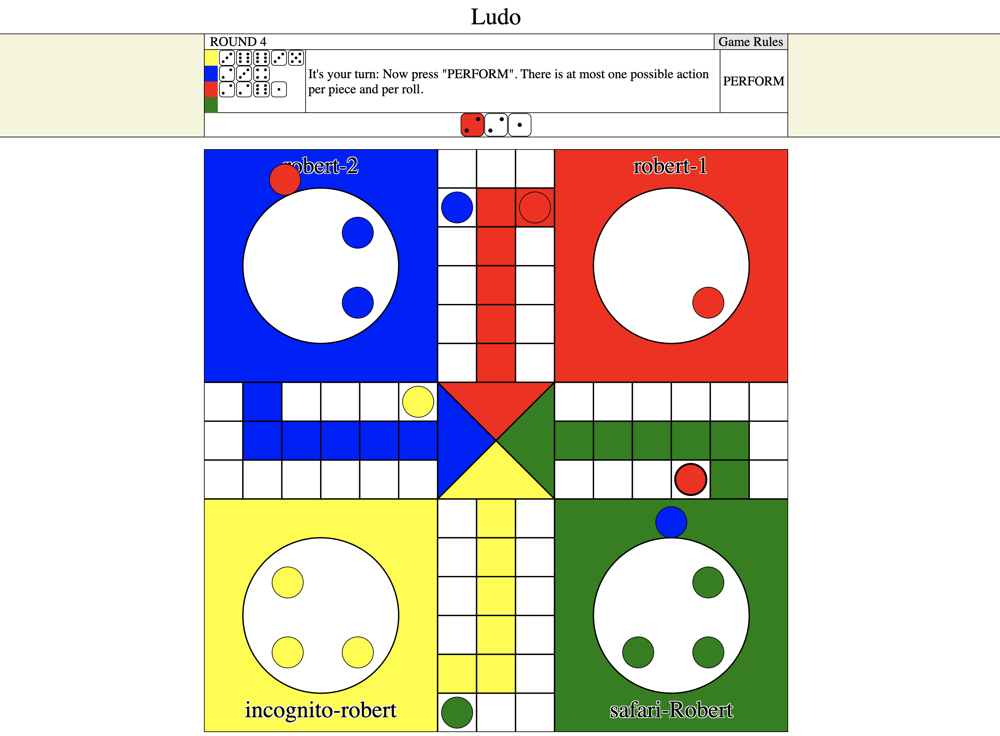
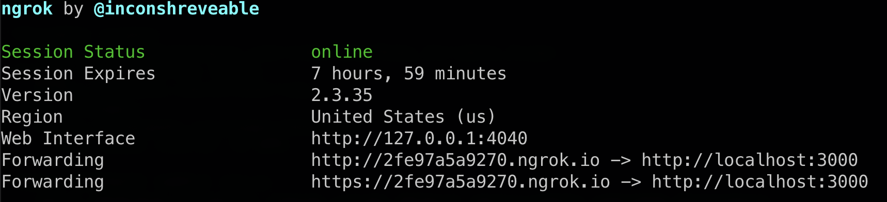

# Ludo

I created this online ludo game as a way to learn how to write web
applications using rails. However, I stopped short of deploying the
game online since it was more of a learning experience and I didn't
want to deal with various bugs from trying to deploy it on Heroku.
**However, anyone can pull the code and run the application
locally so that they can play with friends! More details on this
below.**

Here's a view of the what game looks like:


## How to Run Locally

If you are already familiar with rails, this will be super easy. If
you are not, you might have to do a little more work to get this to
work.

In order to run this app locally (and thus play with friends), you have
to first ensure that you have the required binaries:

1. Ruby in version 2.7.1 or greater (as long as is backward compatible
   with version 2.7.1p83). See
   [ruby](https://www.ruby-lang.org/en/downloads/)'s website.
2. Rails version 6.0.3.x or greater. See
   [rails guide](https://guides.rubyonrails.org/v5.0/getting_started.html).
3. PostgreSQL database.
   - I probably had the most trouble here. There's a problem where Postgre
     seems like it's installed but it's not running. I had to manually
     delete my running version then install it again.
   - Unfortunately I didn't take any note. Hope this is enough to figure
     it out. You might not run into any bug in fact if you didn't have
     Postgre previously installed or installed it correctly the first
     time unlike what I did.
4. Node.js. I am not sure if rails installs it automatically, but if it
   doesn't, you should make sure node.js works. This also comes with
   yarn package manager and a few other packages.

I believe thsoe are all the requirements. After installing them, you can
simply `git clone` this repo, then run `bundle install` to install
everything, and then run locally. To run it, run with the following command:
```bash
bin/rails server -b 0.0.0.0 -p 3000
```

This will bind the IP `0.0.0.0`, which allows people on the same network
to access your application. To be honest, I don't fully understand how
this binding thing works, but the above is what helped make it work.
Here are some resources on that if curious:
- https://stackoverflow.com/questions/7325663/access-webrick-rails-from-another-computer-on-local-network

### (Bonus) Running on Different Networks

To be able to run it online with friends not necessarily on
the same network, [ngrok](https://ngrok.com/) was a solution that worked
relatively well for me. Still, rails requires that you specify the host
that you're deploying from. Let's assume you're running on port `3000`
(and this app runs on `3000` anyway). After you've downloaded and
installed `ngrok`, you run the following on your terminal:

```bash
ngrok http 3000
```

Then, it will output something like this on that window:



Note how it has a URL that forwards to `http://localhost:3000` that matches
the following regex: `https?://.+\.ngrok.io`. Take that url, open
`config/application.rb`, and add the line:
```ruby
config.hosts << URL
```
(where `URL` is the url from ngrok)

I preferred adding this everytime I made a new game because it's more
secure than just allowing any ngrok url forward to my localhost at port
3000.

## Other Information

This app was initially generated using `rails new` with Ruby version 2.7.1p83
and Rails version 6.0.3.

The Wiki contains a bit more detailed informations on the game design and
other things.
